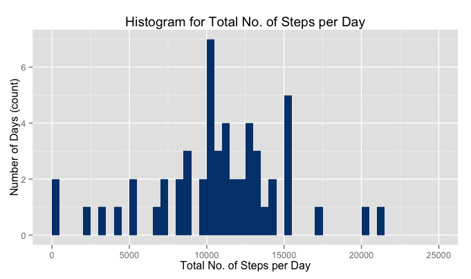
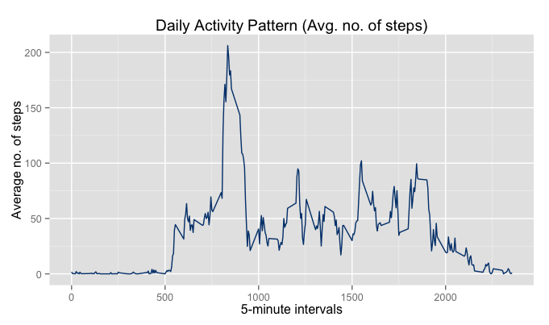
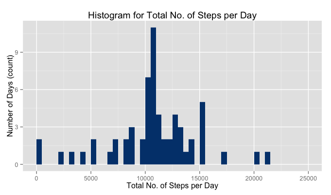
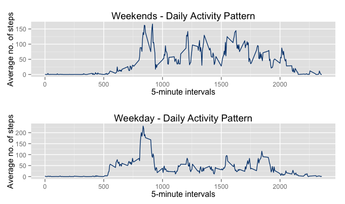

# Reproducible Research: Peer Assessment 1
Veeresh Taranalli  
December 20, 2015  

## Loading and preprocessing the data

```r
# Read the given data
activity_df <- read.csv("activity.csv")   

# Use dplyr for processing and computing results.
# Create a tbl_df from the loaded dataframe.
library(dplyr)
activity_tbl_df <- tbl_df(activity_df)
```


## What is mean total number of steps taken per day?

```r
# Compute the total number of steps day, 
# mean and median of total number of steps per day
activity_tbl_df_group_by_date <- group_by(activity_tbl_df, date)
results_totalsteps <- summarise(activity_tbl_df_group_by_date, 
                                totalsteps=sum(steps))

mean_totalsteps <- mean(results_totalsteps$totalsteps, na.rm = TRUE)
median_totalsteps <- median(results_totalsteps$totalsteps, na.rm = TRUE)

# Plot the histogram of total number of steps per day
library(ggplot2)
g <- ggplot(data=results_totalsteps, aes(results_totalsteps$totalsteps))
g <- g + geom_histogram(breaks=seq(0, 25000, by=500), fill="#00407B")
g <- g + labs(title="Histogram for Total No. of Steps per Day")
g <- g + labs(x="Total No. of Steps per Day", y="Number of Days (count)")
print(g)
```

 

```r
# Report mean and median of total number of steps per day
cat("Mean Total No. of Steps per Day: ", mean_totalsteps, fill = TRUE)
```

```
## Mean Total No. of Steps per Day:  10766.19
```

```r
cat("Median Total No. of Steps per Day: ", median_totalsteps, fill = TRUE)
```

```
## Median Total No. of Steps per Day:  10765
```

## What is the average daily activity pattern?

```r
# Compute the daily activity pattern and plot the resulting time series
activity_tbl_df_group_by_interval <- group_by(activity_tbl_df, interval)
results_pattern <- summarise(activity_tbl_df_group_by_interval, 
                             avgsteps=mean(steps, na.rm = TRUE))

g <- ggplot(data=results_pattern, aes(results_pattern$interval, 
                                      results_pattern$avgsteps))
g <- g + geom_line(col="#00407B")
g <- g + labs(title="Daily Activity Pattern (Avg. no. of steps)")
g <- g + labs(x="5-minute intervals", y="Average no. of steps")
print(g)
```

 

```r
# Identify the 5-minute interval containing max. no. of steps
max_avgsteps_loc <- which.max(results_pattern$avgsteps)
intvl_start <- max_avgsteps_loc*5 - 5
intvl_end <- max_avgsteps_loc*5
cat("5-minute interval containing maximum no. of steps:",
    intvl_start, "-", intvl_end, "\n")
```

```
## 5-minute interval containing maximum no. of steps: 515 - 520
```
## Imputing missing values

```r
# Counting number of rows with missing values (NA's)
count_na <- sum(is.na(activity_tbl_df$steps))
cat("Total no. of rows with missing values (NA's):", count_na)
```

```
## Total no. of rows with missing values (NA's): 2304
```

```r
# Imputing the missing values using mean of the 5-minute interval
# and creating a new dataset with imputed values.
activity_tbl_df_imp <- activity_tbl_df
missing_rows <- is.na(activity_tbl_df_imp$steps)
missing_intervals <- activity_tbl_df_imp$interval[missing_rows]
imp_vector <- c()
for (i in missing_intervals) {
    imp_val <- results_pattern$avgsteps[results_pattern$interval == i]
    imp_vector <- c(imp_vector, imp_val)
}
activity_tbl_df_imp$steps[is.na(activity_tbl_df_imp$steps)] <- imp_vector

# Using the missing value imputed dataset
# Compute the total number of steps day, 
# mean and median of total number of steps per day
activity_tbl_df_imp_group_by_date <- group_by(activity_tbl_df_imp, date)
results_totalsteps <- summarise(activity_tbl_df_imp_group_by_date, 
                                totalsteps=sum(steps))

mean_totalsteps <- mean(results_totalsteps$totalsteps)
median_totalsteps <- median(results_totalsteps$totalsteps)

# Plot the histogram of total number of steps per day
g <- ggplot(data=results_totalsteps, aes(results_totalsteps$totalsteps))
g <- g + geom_histogram(breaks=seq(0, 25000, by=500), fill="#00407B")
g <- g + labs(title="Histogram for Total No. of Steps per Day")
g <- g + labs(x="Total No. of Steps per Day", y="Number of Days (count)")
print(g)
```

 

```r
# Report mean and median of total number of steps per day
cat("Mean Total No. of Steps per Day: ", mean_totalsteps, fill = TRUE)
```

```
## Mean Total No. of Steps per Day:  10766.19
```

```r
cat("Median Total No. of Steps per Day: ", median_totalsteps, fill = TRUE)
```

```
## Median Total No. of Steps per Day:  10766.19
```

We observe that the mean remains the same after imputation of the missing values, whereas the median changes and is equal to the mean after the imputation. We also observe from the histogram plot that the imputation of the missing values increases the number of days corresponding to the total step counts bins. 

## Are there differences in activity patterns between weekdays and weekends?


```r
# Create a factor variable for identifying weekends/weekdays
activity_tbl_df_imp <- mutate(activity_tbl_df_imp, isweekend = (weekdays(as.POSIXlt(date)) == "Saturday" | 
                                                                weekdays(as.POSIXlt(date)) == "Sunday"))
activity_tbl_df_imp_weekend <- activity_tbl_df_imp[activity_tbl_df_imp$isweekend, ]
activity_tbl_df_imp_weekday <- activity_tbl_df_imp[!activity_tbl_df_imp$isweekend, ]

# Compute the daily activity pattern and plot the resulting time series
activity_tbl_df_imp_weekend_group_by_interval <- group_by(activity_tbl_df_imp_weekend, interval)
results_pattern_weekend <- summarise(activity_tbl_df_imp_weekend_group_by_interval, 
                                     avgsteps=mean(steps, na.rm = TRUE))

activity_tbl_df_imp_weekday_group_by_interval <- group_by(activity_tbl_df_imp_weekday, interval)
results_pattern_weekday <- summarise(activity_tbl_df_imp_weekday_group_by_interval, 
                                     avgsteps=mean(steps, na.rm = TRUE))

library(gridExtra)
plot1 <- ggplot(data=results_pattern_weekend, aes(results_pattern_weekend$interval, 
                                                  results_pattern_weekend$avgsteps))
plot1 <- plot1 + geom_line(col="#00407B")
plot1 <- plot1 + labs(title="Weekends - Daily Activity Pattern")
plot1 <- plot1 + labs(x="5-minute intervals", y="Average no. of steps")

plot2 <- ggplot(data=results_pattern_weekday, aes(results_pattern_weekday$interval, 
                                                  results_pattern_weekday$avgsteps))
plot2 <- plot2 + geom_line(col="#00407B")
plot2 <- plot2 + labs(title="Weekday - Daily Activity Pattern")
plot2 <- plot2 + labs(x="5-minute intervals", y="Average no. of steps")

grid.arrange(plot1, plot2, nrow=2)
```

 

We observe that the activity pattern corresponding to the 5-minute intervals on weekends is more consistent/uniform i.e., the activity (no. of steps taken) is spread out more uniformly across the 5-minute intervals when compared to weekdays. 
